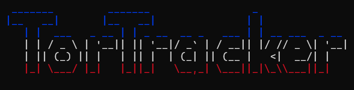

# TorTracker



### General
TorTracker is an innovative project designed to scan an RSS feed, retrieve magnets, and explore hundreds or even thousands of torrents to compile lists of IP addresses. Leveraging the power of bittorrent-dht technology, it continuously scans a vast array of torrents in real-time.

### DB
I decided to use sqlite to have better scalability because the db can undergo thousands of transactions per second and it takes a db that can keep up with the pace

### Docker

You must first change the configuration file config/general.json

```bash

docker build -t tortracker .
docker run -d --name tortracker -p 3000:3000 tortracker

```
